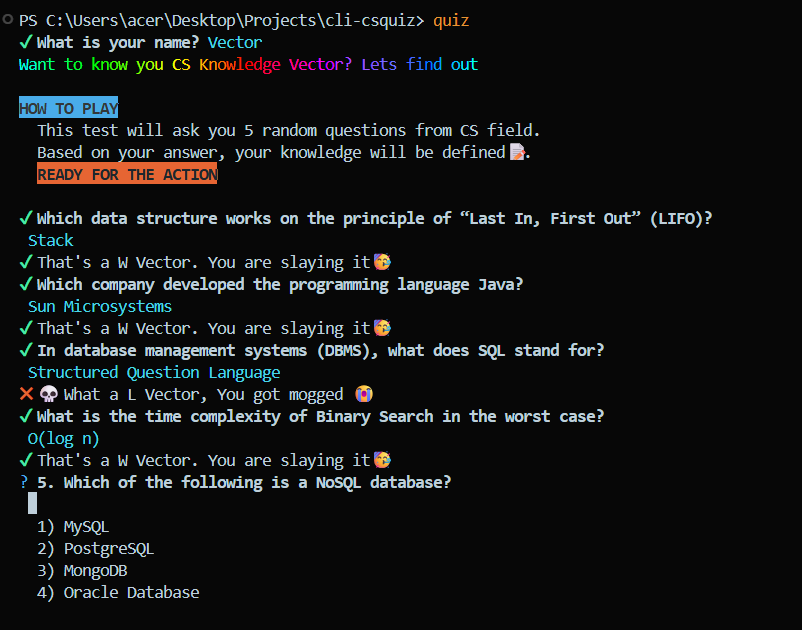
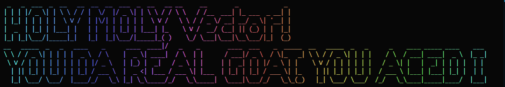

<h1 align="center">
	<br>
	<br>
	
	<br>
	<br>
	<br>
</h1>

> Test your CS knowledge with quick questions.



# cli-csquiz

A simple interactive CLI quiz app for Computer Science questions built with Node.js. Test your CS knowledge directly from the terminal in a fun and lightweight way.

## Installation

Install npm package

```bash
  npm install cli-csquiz
```

## Usage

After installation, run the below command in terminal to run the CLI application:

```javascript
npx quiz
```
